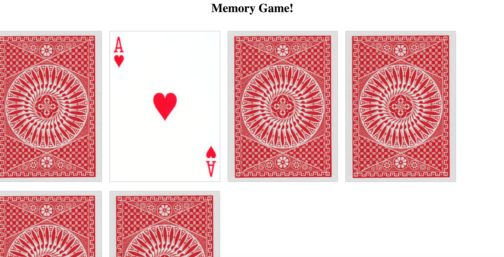

Three versions with .js file. 

Complete Version is in memory1.js 

This version I completed by doing some additional research/studying. Reminded myself of concepts and learned a little more in-depth as needed as I was coding. Got a lot of practice with handling events, arrays, data-attributes, and DOM manipulation. 

Going to continue studying and researching how I can make it better. 

When looking at app.js. My objective was to Build the game of memory without any google-searches only using what I can remember. 

 Really close! 

 Built game with front's of cards displaying while I was making sure game logic was working. 

 What needed to happen in that first attempt with app.js: 
  1) Needed to refactor Js to display none and onClick show card;

   2) I needed a setTimeout function inside the hideCard function to fire after a few seconds so player can see both cards before cards flip back. Couldn't remember how to write setTimeout for this context without refreshing myself and learning more about it. I had the idea but I wanted to study it more. Need more practice with event handlers "timers": setTimeout and setInterval 
   
  3) Also in this past version  when I double clicked an element needed to make it so it doesn't match it's self, and stop eventHandler for matched elements. Need to study more to understand how to execute this. 

memory.js was the step between app.js and memory1.js: I kept all 3. 